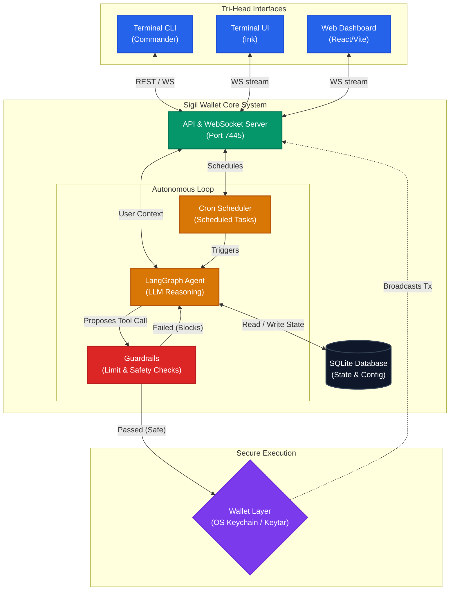

# Architecture Overview

Sigil Wallet operates on a **Tri-Head Architecture** (CLI, TUI, Web Dashboard) connected to a unified Node.js backend (`core`). Agents run continuous autonomous loops (powered by LangGraph) to manage SPL tokens, rebalance portfolios, and execute natural-language directives.

## System Diagram

## Layers & Components

### 1. Agent Layer
The Agent Layer (`/packages/core/src/agent`) is built primarily on **LangGraph**. It handles the continuous reasoning loop of the agent, making decisions, reading context from the database, and issuing *Tool Calls* (intents).
**Crucially**, this layer does not have direct access to private keys or executing blockchain transactions.

### 2. Guardrails Layer
The Guardrails Layer (`/packages/core/src/lib/Guardrails.ts`) acts as the security middleware. When the Agent Layer issues an intent to execute a tool (like a token swap or transfer), the Guardrails Layer intercepts it. It evaluates the intent against limits, directives, and user constraints stored in the SQLite database. If the intent violates these constraints, execution fails and control is handed back to the Agent with the failure reason.

### 3. Wallet Layer
The Wallet Layer (`/packages/core/src/wallet`) is the **only** layer with the authority and capability to access private keys (stored in the **OS Keychain** via `keytar`) and sign transactions via `@solana/web3.js`.

## Data and State
- **Database**: `better-sqlite3` manages state locally on the user's machines. Tables include `agents`, `logs`, `config`, `providers`, `directives`, and `transactions`. The database is synchronous.
- **Security**: Hard security halts (`sigil kill`) trigger memory purges to drop any unlocked `Keypair` instances immediately and broadcast a system-wide websocket event.
