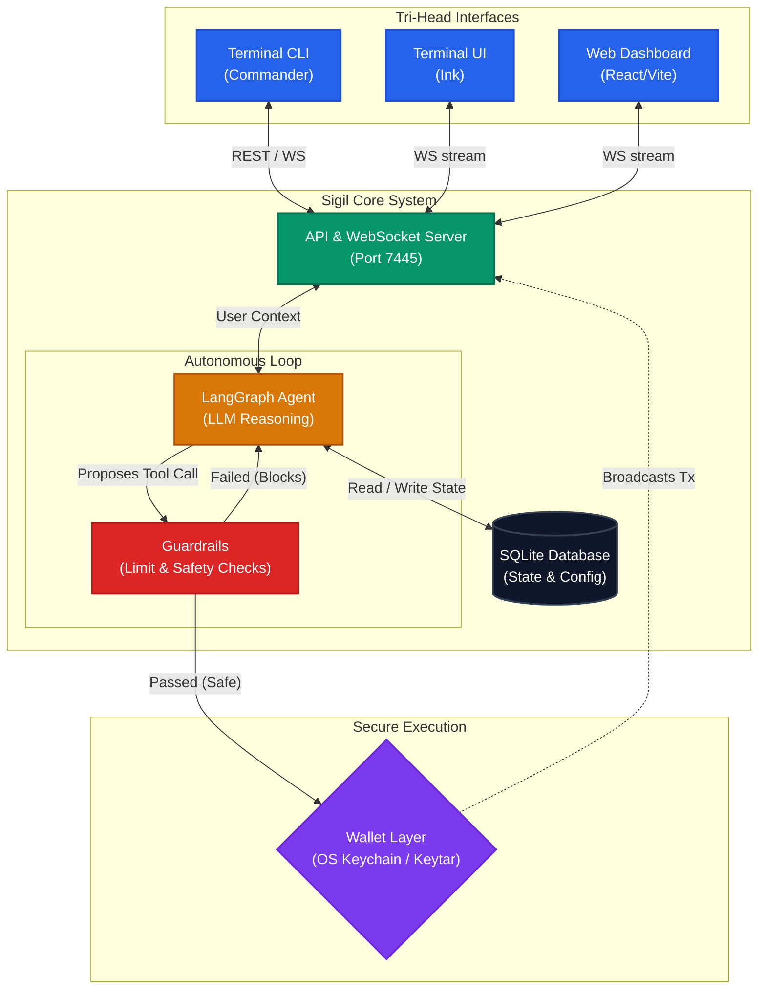

# Sigil

Sigil is a local-first autonomous AI agent platform designed exclusively for Solana Devnet. Built with privacy and absolute user control in mind, Sigil employs a secure, multi-agent framework that empowers users to manage SPL tokens, build custom behavior directives, and seamlessly interact through three distinct interfaces.

## Quick Install (End Users)

Install Sigil globally via npm:

```bash
npm install -g sigil-wallet
```

Then initialize and start using:

```bash
sigil init
sigil start
```

For detailed usage, see the [full documentation](https://sigil-docs.vercel.app/docs) or run `sigil --help`.

[▶️ Watch the Demo](https://youtu.be/PFZNtC4M3-A)

[](https://youtu.be/PFZNtC4M3-A)

## Features

- **Local-First Security:** Your private keys never touch the cloud. They are securely held in your OS Keychain and accessed securely via an isolated Wallet Layer.
- **Tri-Head Architecture:** Engage with your AI agents via the CLI, the Terminal UI (TUI), or a fully-featured local Web Dashboard.
- **LangGraph Brain:** Powered by LangGraph, agents follow continuous, autonomous reasoning loops to manage portfolios or execute simple natural-language directives.
- **Hardened Guardrails:** Ensure total safety; every agent intent is vetted against explicit, user-defined limits (e.g. per-trade caps) before hitting the execution layer.

## Documentation

- **📚 Full Documentation**: [https://sigil-docs.vercel.app/docs](https://sigil-docs.vercel.app/docs)
- **🏗️ Architecture Guide**: [ARCHITECTURE.md](./ARCHITECTURE.md) - System components and layer separation
- **🔐 Security Deep Dive**: [DEEP_DIVE.md](./DEEP_DIVE.md) - Threat model, key management, and failure recovery
- **🤖 AI Agent Capabilities**: [SKILLS.md](./site/public/SKILLS.md) - Machine-readable capability manifest

## Architecture Snapshot



For a comprehensive explanation of our system components, separation of concerns, and data flows, see:

- [ARCHITECTURE.md](./ARCHITECTURE.md) - System design and component overview
- [DEEP_DIVE.md](./DEEP_DIVE.md) - Security architecture, threat model, and recovery strategies

## Getting Started

### Installation

Ensure that you have Node.js and **pnpm** installed. Then, inside the root directory, run:

```bash
pnpm install
```

### Start the platform

You can launch the core backend server locally:

```bash
pnpm --filter core run dev
```

And connect your interface of choice:

- **Web UI:** `pnpm --filter web run dev` (Runs on port 7445)
- **TUI:** `pnpm --filter tui run dev`

### CLI Tool

Initialize the command line utility:

```bash
npx tsx ./packages/core/bin/sigil.ts init
```

## Workspaces

Sigil operates as a `pnpm` monorepo organized into discrete packages:

- `/packages/core`: The Brain & Server backend, incorporating LangGraph, SQLite, and Wallet modules.
- `/packages/tui`: The Ink-based interactive Terminal interface.
- `/packages/web`: The React and Vite-based Web Dashboard.
- `/site`: The project documentation and public web presence (built with Next.js and Fumadocs).
