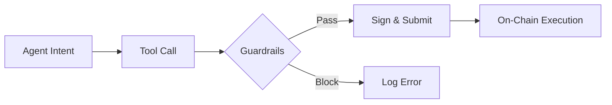

Sigil agents have access to **19 built-in tools** for managing wallets, tokens, DeFi operations, staking, and on-chain utilities on Solana Devnet.

## Tool Categories

<Cards>
  <Card title="Wallet Tools" href="/docs/tools/wallet" />
  <Card title="SPL Token Tools" href="/docs/tools/spl-token" />
  <Card title="Staking Tools" href="/docs/tools/staking" />
  <Card title="DeFi Tools" href="/docs/tools/defi" />
  <Card title="Utility Tools" href="/docs/tools/utilities" />
</Cards>

## Quick Reference

### Wallet & Balance (7 tools)

| Tool                      | Description                                  |
| ------------------------- | -------------------------------------------- |
| `get_balance`             | Check SOL balance and all SPL token holdings |
| `request_airdrop`         | Request SOL from devnet faucet (max 2 SOL)   |
| `transfer_sol`            | Send SOL to an address                       |
| `get_transaction_history` | Fetch recent on-chain transactions           |
| `get_token_accounts`      | List all SPL token accounts                  |
| `get_portfolio_snapshot`  | Full portfolio breakdown with percentages    |
| `get_account_info`        | Fetch on-chain account metadata              |

### SPL Tokens (5 tools)

| Tool                         | Description                                  |
| ---------------------------- | -------------------------------------------- |
| `create_token`               | Create new SPL token with optional metadata  |
| `mint_tokens`                | Mint tokens (requires mint authority)        |
| `burn_tokens`                | Burn tokens from wallet                      |
| `transfer_token`             | Send SPL tokens to another wallet            |
| `close_empty_token_accounts` | Close zero-balance accounts and reclaim rent |

### Staking (4 tools)

| Tool                  | Description                        |
| --------------------- | ---------------------------------- |
| `stake_sol`           | Delegate SOL to a validator        |
| `deactivate_stake`    | Begin stake withdrawal cool-down   |
| `list_validators`     | View active validators with stats  |
| `get_stake_positions` | View all stake accounts and status |

### DeFi (2 tools)

| Tool          | Description                               |
| ------------- | ----------------------------------------- |
| `swap_tokens` | Execute token swap via Jupiter aggregator |
| `fetch_price` | Get real-time USD price for any token     |

### Utilities (1 tool)

| Tool        | Description                              |
| ----------- | ---------------------------------------- |
| `send_memo` | Write a message on-chain (max 566 bytes) |

## Tool Architecture

All state-changing tools route through the **Guardrails Layer** before execution:



Read-only tools (`get_balance`, `fetch_price`, etc.) bypass guardrails since they don't modify state.

## Example Agent Behaviors

### Portfolio Manager

```text
"Check my portfolio every hour. If SOL is more than 60% of holdings,
 swap excess to USDC to maintain 50/50 balance"
```

Uses: `get_portfolio_snapshot`, `fetch_price`, `swap_tokens`

### Token Creator

```text
"Create a token called 'AgentCoin' with symbol 'AGNT' and 9 decimals.
 Mint 1,000,000 tokens to my wallet"
```

Uses: `create_token`, `mint_tokens`

### Staking Bot

```text
"List validators sorted by stake. Stake 5 SOL with the top validator.
 Check my stake positions daily"
```

Uses: `list_validators`, `stake_sol`, `get_stake_positions`

### Cleanup Agent

```text
"Every day at midnight, close all empty token accounts to reclaim rent"
```

Uses: `get_token_accounts`, `close_empty_token_accounts`

## Safety & Limits

All tools are subject to configurable guardrails:

- **Per-trade limits** — Maximum value per transaction
- **Daily volume caps** — Total value per 24 hours
- **Slippage protection** — Maximum price deviation on swaps
- **Recipient allowlists** — Restrict transfers to approved addresses

See [Safety & Guardrails](/docs/guardrails) for detailed configuration.

## Network Configuration

All tools operate on **Solana Devnet**:

- **RPC Endpoint**: `https://api.devnet.solana.com`
- **Explorer**: `https://explorer.solana.com/?cluster=devnet`
- **Commitment Level**: `confirmed`

Price data from `fetch_price` comes from mainnet markets via Jupiter API, but all on-chain transactions execute on devnet.
